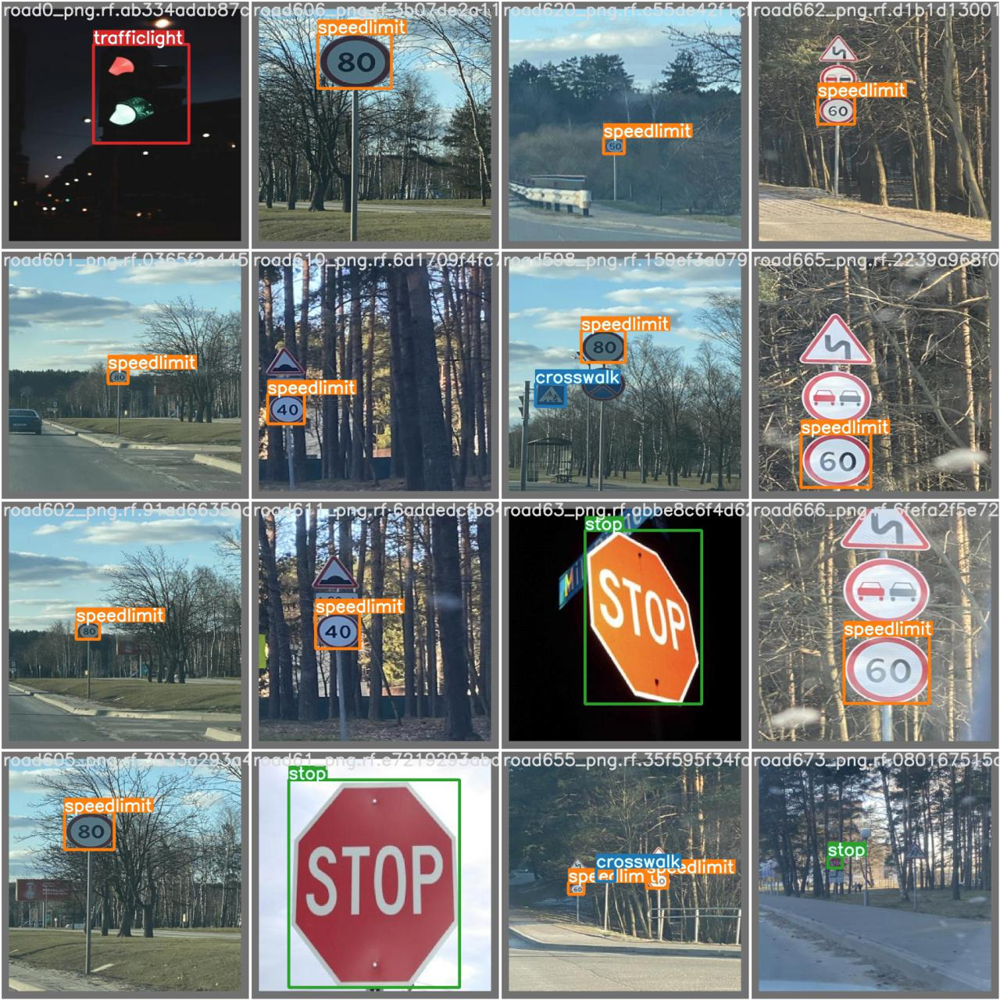

# Road-sign-detection using YOLO-v5

## Description

### [Yolov5](https://github.com/ultralytics/yolov5)
YOLOv5 is a family of **object detection architectures** and models pretrained on the COCO dataset.

## Getting Started

### Dependencies

* YOLOv5
* Annotated dataset of Road sign (I used Roboflow for dataset preparation).

### Creating Dataset

* Import dataset in Roboflow 
* Do data preprocessing (Splitting data, Data Augementation) using Roboflow API
* Export generated dataset in YOLOv5 format using API key or download it.

### Model creation and testing

> If you are using google-colab these steps are not required, use Road_sign_detection_YOLOv5.ipynb

* Clone this repository
```
git clone https://github.com/Anant-mishra1729/Road-sign-detection.git
cd Road-sign-detection
```

* Clone YOLOv5 repository
```
git clone https://github.com/ultralytics/yolov5
cd yolov5
git reset --hard 886f1c03d839575afecb059accf74296fad395b6b
``` 
* Use Road_sign_detection_YOLOv5.ipynb for creating model and Road_sign_test.ipynb for testing purpose.
</details>

> In case of any issue or error go through [Yolov5](https://github.com/ultralytics/yolov5) documentation. 

### Result


## Authors

* [Anant Mishra]("https://github.com/Anant-mishra1729")

## License

This project is licensed under the MIT License - see the LICENSE.md file for details

## Acknowledgments

Road signs dataset

* [Dataset](https://www.kaggle.com/datasets/andrewmvd/road-sign-detection)
* [Roboflow](https://roboflow.com/)